# Database Relationships Analysis

**Generated**: 2026-01-24
**Source**: [000_consolidated_schema.sql](../supabase/migrations/000_consolidated_schema.sql)

---

## ER Diagram (Foreign Key Relationships)

```mermaid
erDiagram
    %% Core Identity
    auth_users ||--|| user_profiles : "1:1"
    user_profiles ||--o| seller_profiles : "1:0..1"

    %% Game Catalog
    games ||--o{ listings : "1:*"
    games ||--o{ wanted_listings : "1:*"
    games ||--o| external_pricing_cache : "1:0..1"

    %% Listings Domain
    user_profiles ||--o{ listings : "seller"
    listings ||--o{ saved_listings : "1:*"
    listings ||--o{ listing_questions : "1:*"
    listings ||--o{ bids : "1:*"
    listings ||--o{ basket_items : "1:*"
    listings ||--o{ conversations : "1:*"
    listings ||--o{ order_items : "1:*"
    wanted_listings ||--o| listings : "source"

    %% Wanted Listings Domain
    user_profiles ||--o{ wanted_listings : "buyer"
    wanted_listings ||--o{ wanted_listing_responses : "1:*"

    %% Messaging Domain
    user_profiles ||--o{ conversations : "buyer"
    user_profiles ||--o{ conversations : "seller"
    conversations ||--o{ messages : "1:*"
    conversations ||--o{ message_read_status : "1:*"
    conversations ||--o{ wanted_listing_responses : "1:*"
    orders ||--o| conversations : "1:0..1"

    %% Questions Domain
    listing_questions ||--o{ listing_questions : "parent"
    auth_users ||--o{ listing_questions : "author"

    %% Auction Domain
    auth_users ||--o{ bids : "bidder"
    auth_users ||--o| listings : "auction_winner"
    auth_users ||--o| listings : "reserved_by"

    %% Shopping Cart Domain
    auth_users ||--o{ baskets : "buyer"
    auth_users ||--o{ baskets : "seller"
    baskets ||--o{ basket_items : "1:*"

    %% Orders Domain
    auth_users ||--o{ orders : "buyer"
    auth_users ||--o{ orders : "seller"
    orders ||--o{ order_items : "1:*"
    orders ||--o{ order_issues : "1:*"
    orders ||--o{ tracking_events : "1:*"
    orders ||--o| seller_reviews : "1:0..1"
    orders ||--o{ payout_transactions : "1:*"

    %% User Actions
    auth_users ||--o{ saved_listings : "1:*"
    auth_users ||--o{ notifications : "1:*"
    auth_users ||--o{ login_activity : "1:*"
    auth_users ||--o| security_audit_log : "1:*"
    auth_users ||--o| user_feedback : "1:*"
    auth_users ||--o| newsletter_subscribers : "1:0..1"

    %% Blocking
    user_profiles ||--o{ blocked_users : "blocker"
    user_profiles ||--o{ blocked_users : "blocked"

    %% Reviews & Payouts
    auth_users ||--o{ seller_reviews : "buyer"
    auth_users ||--o{ seller_reviews : "seller"
    auth_users ||--o{ seller_payouts : "1:*"
    auth_users ||--o{ payout_transactions : "seller"

    %% Entity Definitions
    auth_users {
        uuid id PK
    }

    user_profiles {
        uuid id PK,FK
        text full_name
        text email
        text country
        boolean is_staff
        timestamptz deleted_at
    }

    seller_profiles {
        uuid user_id PK,FK
        text seller_status
        text stripe_connect_account_id
        integer dac7_annual_transaction_count
    }

    games {
        integer id PK
        text name
        boolean is_expansion
    }

    listings {
        uuid id PK
        integer bgg_game_id FK
        uuid seller_id FK
        uuid auction_winner_id FK
        uuid reserved_by FK
        uuid source_wanted_listing_id FK
        text status
        text listing_type
    }

    wanted_listings {
        uuid id PK
        integer bgg_game_id FK
        uuid buyer_id FK
        text status
    }

    orders {
        uuid id PK
        uuid buyer_id FK
        uuid seller_id FK
        uuid cancelled_by FK
        text status
    }

    conversations {
        uuid id PK
        uuid listing_id FK
        uuid buyer_id FK
        uuid seller_id FK
        uuid order_id FK
    }

    messages {
        uuid id PK
        uuid conversation_id FK
        uuid sender_id FK
    }
```



---

## Analysis Results

### 1. Tables Lacking Explicit ON DELETE Behavior

These FK columns have no explicit `ON DELETE` clause (defaults to `NO ACTION`):

| Table | Column | References | Risk |
|-------|--------|------------|------|
| `listings` | `auction_winner_id` | `auth.users(id)` | **High** - Blocks user deletion if they won an auction |
| `listings` | `reserved_by` | `auth.users(id)` | **Medium** - Blocks user deletion if they have cart reservation |
| `orders` | `cancelled_by` | `auth.users(id)` | **High** - Blocks user deletion if they cancelled an order |
| `order_issues` | `resolved_by` | `auth.users(id)` | **Medium** - Blocks staff deletion if they resolved issues |
| `user_feedback` | `reviewed_by` | `auth.users(id)` | **Medium** - Blocks staff deletion if they reviewed feedback |

**Recommendation**: Add `ON DELETE SET NULL` to all these columns.

---

### 2. Orphaned Tables (No Relationships)

All tables in the public schema have at least one relationship. The only "root" table is:

| Table | Purpose | Status |
|-------|---------|--------|
| `games` | BGG game catalog | **Correct** - Root entity, referenced by listings/wanted |

---

### 3. Circular Dependencies

**No true circular dependencies found.**

The closest is:
- `listings.source_wanted_listing_id` → `wanted_listings` (forward reference)
- `wanted_listings` does NOT reference `listings`

This is intentional: a listing can be created in response to a wanted listing.

---

### 4. Missing Junction Tables

**No missing junction tables identified.**

Existing junction tables serve their purpose:
- `saved_listings` - Users ↔ Listings
- `basket_items` - Baskets ↔ Listings
- `blocked_users` - Users ↔ Users
- `wanted_listing_responses` - Wanted Listings ↔ Sellers (with conversation)

---

### 5. Inconsistent FK Target Tables

Some FKs reference `auth.users` while related FKs reference `user_profiles`:

| Pattern | Tables Using `auth.users` | Tables Using `user_profiles` |
|---------|---------------------------|------------------------------|
| User identity | `saved_listings`, `bids`, `notifications`, `login_activity`, `baskets`, `orders`, `seller_reviews` | `listings`, `wanted_listings`, `conversations`, `messages`, `blocked_users`, `seller_profiles` |

This is **intentional**:
- `auth.users` - For system-level operations (auth, cart, orders)
- `user_profiles` - For profile-dependent features (messaging, listings)

---

### 6. Missing FK Indexes

All FK columns have corresponding indexes. **No action needed.**

---

## ALTER TABLE Recommendations

### Migration: Add ON DELETE SET NULL + Reservation Cleanup Trigger

```sql
-- ============================================================================
-- Migration: 104_fix_fk_delete_behaviors.sql
-- ============================================================================

-- TRIGGER: Clear reservation timestamps when user is deleted
-- Prevents "ghost reservations" where reserved_until blocks new carts
-- but reserved_by is NULL (orphaned by FK cascade)
CREATE OR REPLACE FUNCTION clear_listing_reservations_on_user_delete()
RETURNS TRIGGER AS $$
BEGIN
  UPDATE listings
  SET reserved_by = NULL, reserved_until = NULL, updated_at = NOW()
  WHERE reserved_by = OLD.id;
  RETURN OLD;
END;
$$ LANGUAGE plpgsql SECURITY DEFINER;

CREATE TRIGGER clear_reservations_before_user_delete
  BEFORE DELETE ON auth.users
  FOR EACH ROW
  EXECUTE FUNCTION clear_listing_reservations_on_user_delete();

-- FK Constraints with ON DELETE SET NULL
ALTER TABLE listings
  ADD CONSTRAINT listings_auction_winner_id_fkey
  FOREIGN KEY (auction_winner_id) REFERENCES auth.users(id) ON DELETE SET NULL;

ALTER TABLE listings
  ADD CONSTRAINT listings_reserved_by_fkey
  FOREIGN KEY (reserved_by) REFERENCES auth.users(id) ON DELETE SET NULL;

ALTER TABLE orders
  ADD CONSTRAINT orders_cancelled_by_fkey
  FOREIGN KEY (cancelled_by) REFERENCES auth.users(id) ON DELETE SET NULL;

ALTER TABLE order_issues
  ADD CONSTRAINT order_issues_resolved_by_fkey
  FOREIGN KEY (resolved_by) REFERENCES auth.users(id) ON DELETE SET NULL;

ALTER TABLE user_feedback
  ADD CONSTRAINT user_feedback_reviewed_by_fkey
  FOREIGN KEY (reviewed_by) REFERENCES auth.users(id) ON DELETE SET NULL;
```

**Edge Case Addressed**: The `add_to_cart` function checks `reserved_until > NOW()` without checking `reserved_by`. Without the trigger, a deleted user would leave listings in a "ghost reserved" state where the timestamp blocks new carts but the cleanup cron can't find the orphaned basket_items.

---

## Complete FK Relationship Table

| Source Table | Source Column | Target Table | Target Column | ON DELETE | Index Exists |
|--------------|---------------|--------------|---------------|-----------|--------------|
| user_profiles | id | auth.users | id | CASCADE | Yes (PK) |
| seller_profiles | user_id | user_profiles | id | CASCADE | Yes (PK) |
| listings | bgg_game_id | games | id | RESTRICT | Yes |
| listings | seller_id | user_profiles | id | CASCADE | Yes |
| listings | auction_winner_id | auth.users | id | **NO ACTION** | Yes |
| listings | reserved_by | auth.users | id | **NO ACTION** | Yes |
| listings | source_wanted_listing_id | wanted_listings | id | SET NULL | Yes |
| saved_listings | user_id | auth.users | id | CASCADE | Yes |
| saved_listings | listing_id | listings | id | CASCADE | Yes |
| wanted_listings | bgg_game_id | games | id | RESTRICT | Yes |
| wanted_listings | buyer_id | user_profiles | id | CASCADE | Yes |
| wanted_listing_responses | wanted_listing_id | wanted_listings | id | CASCADE | Yes |
| wanted_listing_responses | seller_id | user_profiles | id | CASCADE | Yes |
| wanted_listing_responses | conversation_id | conversations | id | CASCADE | Yes |
| listing_questions | listing_id | listings | id | CASCADE | Yes |
| listing_questions | user_id | auth.users | id | CASCADE | Yes |
| listing_questions | parent_id | listing_questions | id | CASCADE | Yes |
| bids | listing_id | listings | id | CASCADE | Yes |
| bids | bidder_id | auth.users | id | CASCADE | Yes |
| notifications | user_id | auth.users | id | CASCADE | Yes |
| conversations | listing_id | listings | id | CASCADE | Yes |
| conversations | buyer_id | user_profiles | id | CASCADE | Yes |
| conversations | seller_id | user_profiles | id | CASCADE | Yes |
| conversations | order_id | orders | id | SET NULL | Yes |
| messages | conversation_id | conversations | id | CASCADE | Yes |
| messages | sender_id | user_profiles | id | CASCADE | Yes |
| message_read_status | user_id | auth.users | id | CASCADE | Yes |
| message_read_status | conversation_id | conversations | id | CASCADE | Yes |
| message_read_status | last_read_message_id | messages | id | SET NULL | Yes |
| blocked_users | blocker_id | user_profiles | id | CASCADE | Yes |
| blocked_users | blocked_id | user_profiles | id | CASCADE | Yes |
| login_activity | user_id | auth.users | id | CASCADE | Yes |
| security_audit_log | user_id | auth.users | id | SET NULL | Yes |
| baskets | buyer_id | auth.users | id | CASCADE | Yes |
| baskets | seller_id | auth.users | id | CASCADE | Yes |
| basket_items | basket_id | baskets | id | CASCADE | Yes |
| basket_items | listing_id | listings | id | CASCADE | Yes |
| orders | buyer_id | auth.users | id | RESTRICT | Yes |
| orders | seller_id | auth.users | id | RESTRICT | Yes |
| orders | cancelled_by | auth.users | id | **NO ACTION** | Yes |
| order_items | order_id | orders | id | CASCADE | Yes |
| order_items | listing_id | listings | id | RESTRICT | Yes |
| order_issues | order_id | orders | id | CASCADE | Yes |
| order_issues | reporter_id | auth.users | id | CASCADE | Yes |
| order_issues | resolved_by | auth.users | id | **NO ACTION** | Yes |
| tracking_events | order_id | orders | id | CASCADE | Yes |
| payout_transactions | order_id | orders | id | RESTRICT | Yes |
| payout_transactions | seller_id | auth.users | id | RESTRICT | Yes |
| seller_payouts | user_id | auth.users | id | RESTRICT | Yes |
| seller_reviews | order_id | orders | id | CASCADE | Yes |
| seller_reviews | buyer_id | auth.users | id | CASCADE | Yes |
| seller_reviews | seller_id | auth.users | id | CASCADE | Yes |
| external_pricing_cache | bgg_game_id | games | id | CASCADE | Yes |
| user_feedback | user_id | auth.users | id | SET NULL | Yes |
| user_feedback | reviewed_by | auth.users | id | **NO ACTION** | Yes |
| newsletter_subscribers | user_id | auth.users | id | SET NULL | Yes |

---

## Summary

| Issue | Count | Severity | Action |
|-------|-------|----------|--------|
| Missing ON DELETE behavior | 5 | Medium | Apply migration 104 |
| Orphaned tables | 0 | None | N/A |
| Circular dependencies | 0 | None | N/A |
| Missing junction tables | 0 | None | N/A |
| Missing FK indexes | 0 | None | N/A |

The database schema is well-designed with proper FK constraints and indexes. The only recommendation is to add explicit `ON DELETE SET NULL` to 5 optional FK columns to prevent unexpected deletion blocks.
